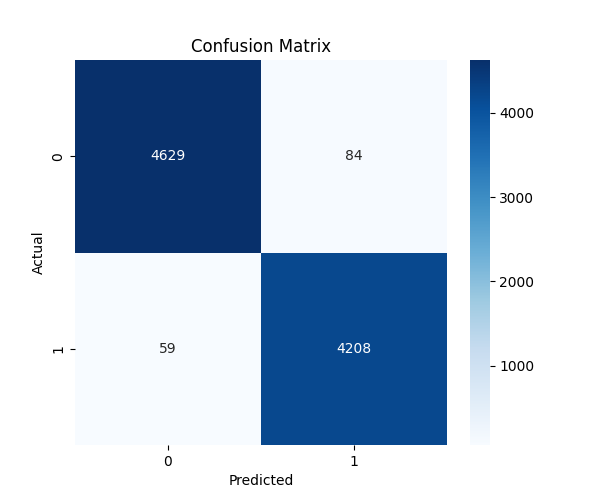

# 📰 Fake News Detection using Machine Learning

A Natural Language Processing (NLP) project that detects whether a news article is **Fake or Real** using machine learning.

The model analyzes news text, extracts meaningful features using **TF-IDF vectorization**, and classifies articles using a **Logistic Regression classifier**.

---

# 🚀 Project Overview

Fake news spreads rapidly on the internet and social media. This project demonstrates how machine learning can automatically detect misleading or fabricated news articles.

The model is trained on a large dataset of **real and fake news articles** and learns linguistic patterns that differentiate credible journalism from fabricated content.

---

# 🧠 Machine Learning Pipeline

The complete AI workflow implemented in this project:

1️⃣ **Dataset Loading**
News articles are loaded from a Kaggle dataset containing thousands of real and fake news examples.

2️⃣ **Data Preprocessing**
Text data is cleaned and prepared for machine learning.

3️⃣ **Feature Extraction (TF-IDF)**
News text is converted into numerical vectors using **Term Frequency–Inverse Document Frequency**.

4️⃣ **Model Training**
A **Logistic Regression classifier** is trained to distinguish fake news from real news.

5️⃣ **Model Evaluation**
The model performance is evaluated using accuracy and confusion matrix.

6️⃣ **Prediction System**
Users can input custom news text and the model predicts whether it is **Fake or Real**.

---

# 📊 Model Performance

**Accuracy:**
98.56%

The model performs strongly on unseen test data.

---

# 📈 Confusion Matrix

Model evaluation visualization:

---

# 🔍 Example Predictions

### Example 1

Input:
Aliens have landed in New York and taken control of the government.

Prediction:
Fake News

---

### Example 2

Input:
The government introduced a new economic policy to improve trade relations.

Prediction:
Real News

---

# 🛠 Technologies Used

Python
Pandas
NumPy
Scikit-learn
Matplotlib
Seaborn
Jupyter Notebook

---

# 📁 Project Structure

fake-news-detection

fake_news_model.ipynb → Machine learning notebook
confusion_matrix.png → Model evaluation visualization
README.md → Project documentation
requirements.txt → Python dependencies

---

# 📦 Installation

Clone the repository:

git clone https://github.com/yourusername/fake-news-detection.git

Install dependencies:

pip install -r requirements.txt

Run the notebook:

jupyter notebook

---

# 🎯 Key Skills Demonstrated

Natural Language Processing (NLP)
Text Feature Engineering
Machine Learning Model Training
Model Evaluation
Data Visualization
Python Data Science Workflow

---

# 👨‍💻 Author

Henil Modi
